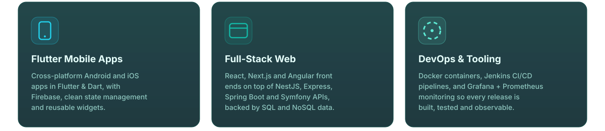
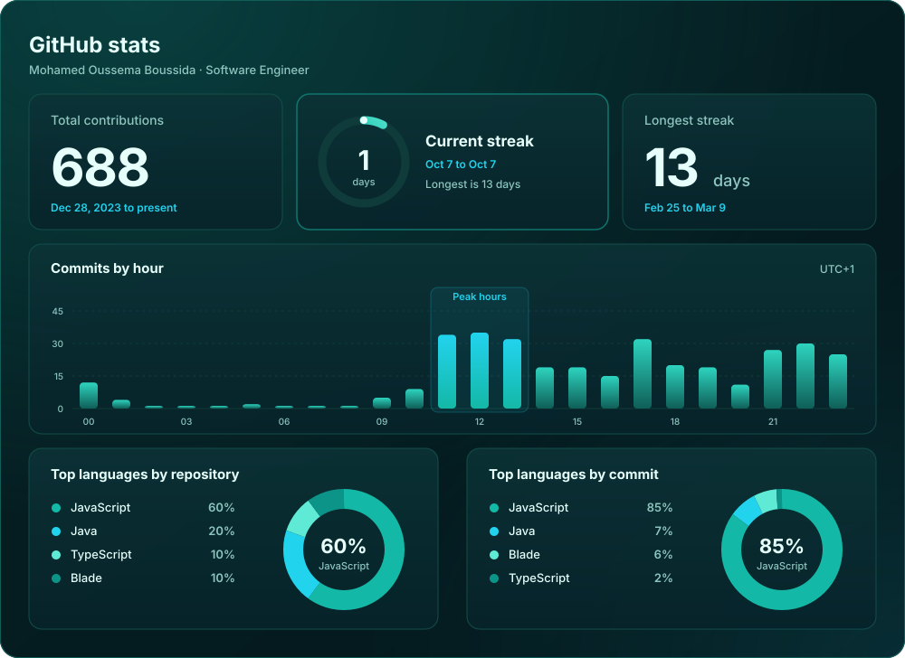

  

&nbsp;&nbsp;

&nbsp;&nbsp;

 

 

## About &nbsp;<code>$ whoami</code>

Software Engineer at **[Spark Talent Alliance](https://sparktalentalliance.com)**, specialized in web and internet technologies and driven by a strong passion for technology and problem-solving.

I work across the whole product: Flutter mobile apps, full-stack web platforms, and the DevOps tooling that builds, ships and monitors them.

 

## What I'm building &nbsp;<code>$ cat current-focus.md</code>

 

## Tech stack &nbsp;<code>$ cat tech-stack.yaml</code>

<table>
  <tr>
    <td><b>Languages</b></td>
    <td>
      
      
      
      
      
      
      
      
      
      
    </td>
  </tr>
  <tr>
    <td><b>Mobile</b></td>
    <td>
      
      
      
    </td>
  </tr>
  <tr>
    <td><b>Front-end</b></td>
    <td>
      
      
      
      
      
      
      
    </td>
  </tr>
  <tr>
    <td><b>Back-end</b></td>
    <td>
      
      
      
      
      
      
      
      
    </td>
  </tr>
  <tr>
    <td><b>Databases</b></td>
    <td>
      
      
      
      
      
    </td>
  </tr>
  <tr>
    <td><b>DevOps</b></td>
    <td>
      
      
      
      
      
      
      
      
    </td>
  </tr>
  <tr>
    <td><b>Design & Tooling</b></td>
    <td>
      
      
      
      
      
      
      
    </td>
  </tr>
</table>

 

## GitHub activity &nbsp;<code>$ git log --oneline --graph</code>

  

 

 

## Let's connect &nbsp;<code>$ ssh connect@oussema</code>

&nbsp;

&nbsp;

&nbsp;

 

